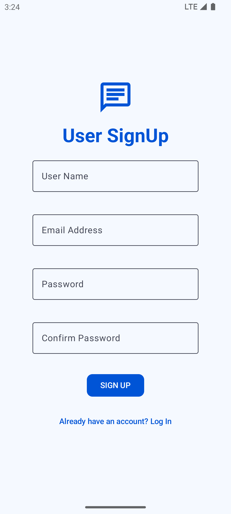
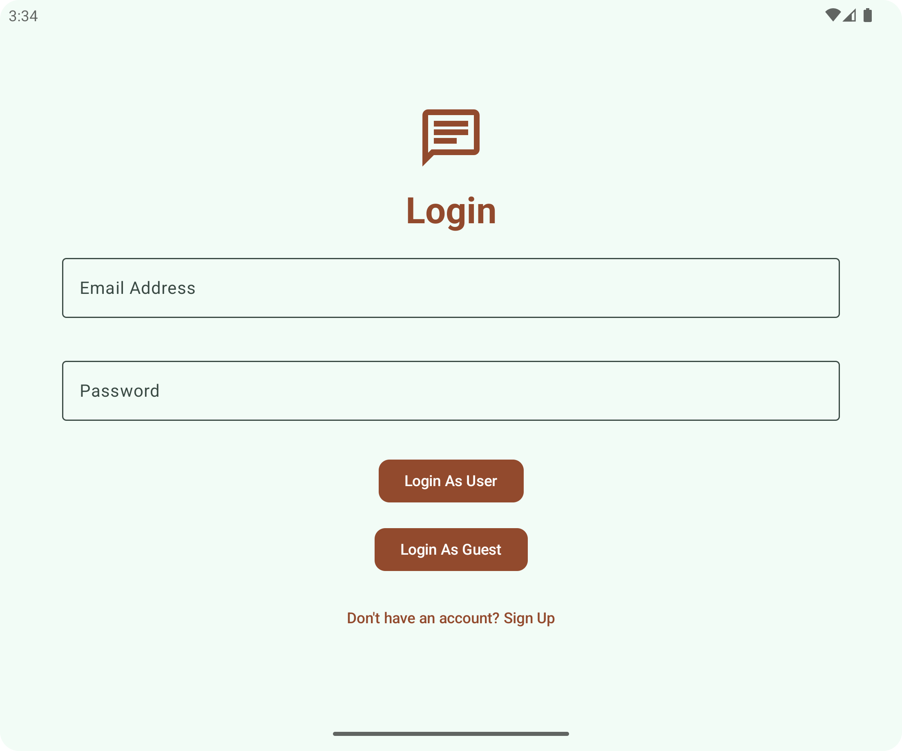

# Android Chatting App using [Stream SDK](https://getstream.io/chat/docs/android/?language=kotlin)

## Introduction
This app is made as a POC of usage for Stream SDK. The goal was to develop a app with authentication system and autheticated user can start conversation with each other on a one to one or a group chat.

## Planned Feature
- User Authentication
- One to one conversation
- Group Conversation
- Role Based User actions
- Create / Delete Group
- Start One to one Conversation
- User profile
- [More in pipeline]

### Current progress
Currently User can Sign up & Login to the App and can start conversation one to one manner. They can also create groups [Still no add member features]. Also user can search for each other and start conversation if they never talked before in the app.

### WishList Feature
- Give user more control over group feature.
- Give roles to user inside channels so that they can moderate groups.
- add/remove user from group if user is the admin of group.

## Quick Demo
### 1. User Sign Up

### 2. User Log In

### 3. Channel Screen

### 4. Craete Group/Channel

### 5. Search Users

### 6. User Info Dialog

### 7. Drawer Menu

### 8. Message Screen

## Conclusion
This Project will allow to made the road for future chat base app development more smooth because this one can be taken as a base and start modify on this project will save development time. Also the core package has documentation about every component inside it so future development can be more helpful.